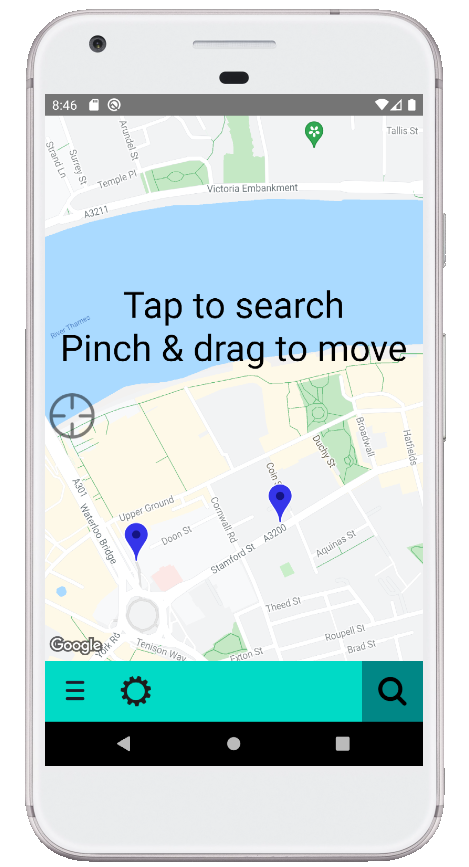

# Cycle Parking App

A React Native app for finding cycle stands in London.

## Features:
- Find cycle stands near you, or at any location in London.
- Show details about the stand such as if it is covered, secure, and pictures of it.
- Bookmark favourites for getting back to them easily.
- Open google maps and generate a route in cycling mode between your location and a stand.

# Demo

  

    
  

  

  

    <video height=500 controls>
    <source src="./emulator-demo.mp4">
    Readme cannot display video. Find it <a href="./emulator-demo.mp4">Here</a>
  </video> 
  

  

    Watch on streamable <a href="https://streamable.com/srgli1">Here</a>
  

  

# Why
Dipping my toes into React Native. 

If I were to do the same project again from the start I'd have designed the layout and features ahead of time. Very much started as a hello world that spiralled outwards. 

With a better notion of stateful / stateless components I'd use functional ones more and fewer class based components.

I spent too long trying to implement online functionality for automatically updating the list of cycle stands from TFL. In retrospect this was a bit optimistic for a first ever go on the framework let alone a mobile app.

# How
- react-native & react-native-maps.
- TFL Place API.
- Geohashing.

# Note
react-native-maps requires a Google API key to run on android.

The key can beset on `com.google.android.geo.API_KEY` in `android\app\src\main\AndroidManifest.xml`.

The current key in the file has been deactivated.